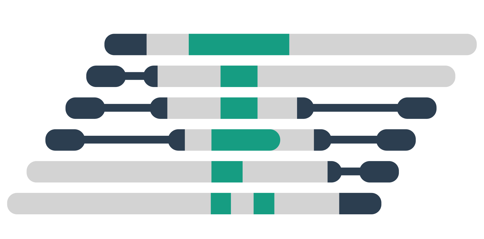

# ATaRVa - a tandem repeat genotyper


<p align=center>
  
</p>

ATaRVa (pronounced uh-thur-va, IPA: /əθərvə/, Sanskrit: अथर्व) is a technology-agnostic tandem repeat genotyper, specially designed for long read data. The name expands to **A**nalysis of **Ta**ndem **R**epeat **Va**riation, and is derived from the the Sanskrit word _Atharva_ meaning knowledge.


## Motivation
Long-read sequencing propelled comprehensive analysis of tandem repeats (TRs) in genomes. Current long-read TR genotypers are either platform specific or computationally inefficient. ATaRva outperforms existing tools while running an order of magnitude faster. ATaRVa also supports multi-threading, haplotyping, motif decomposition and methylation profiling, making it an invaluable tool for population scale TR analyses.

## Installation

### PyPI installation

ATaRVa can be directly installed using pip with the package name `ATaRVa`.

```bash
$ pip install ATaRVa
```
Alternatively, it can be installed from the source code:<br>
It is recommended to install this inside a Python virtual environment.

```bash
# Create a python env
$ python -m venv atarva_env

# Activate the env
$ source atarva_env/bin/activate
$ pip install build

# Download the git repo
$ git clone https://github.com/SowpatiLab/ATaRVa.git

# Install
$ cd ATaRVa
$ python -m build
$ pip install .

# Deactivate the env
$ deactivate
```
Both of the methods add a console command `atarva`, which can be executed from any directory

**NOTE: This tool has been tested and is recommended to be used with Python versions between 3.9 and 3.12 (inclusive).**

### Docker installation
ATaRVa can also be installed using the provided **Docker** image with the following steps:
```bash
$ cd ATaRVa
$ docker build --network host -t atarva
```

## Documentation

* [Usage](#usage)
* [`genotype` usage](/docs/genotype_usage.md)
* [`merge` usage](/docs/merge_usage.md)
* [FAQs](/docs/FAQ's.md)
* [Changelog](/docs/changelog.md)


## Usage
The help message and available subcommands can be accessed using

```bash
$ atarva -h
#  or
$ atarva --help
```
which gives the following output

```
ATaRVa - Analysis of Tandem Repeat Variants
Sowpati Lab

Usage:
    atarva [OPTIONS] <COMMAND>

Commands:
  genotype  Tandem Repeat Genotyper
  merge     Merge ATaRVa VCF files

Options:
  -h, --help     Print help
  -v, --version  Print version
```


## Analysis script
All scripts used for analysis are provided in [ATaRVa_Manuscript](https://github.com/SowpatiLab/ATaRVa_Manuscript)

## Citation
If you find ATaRVa useful for your research, please cite it as follows:

ATaRVa: Analysis of Tandem Repeat Variation from Long Read Sequencing data  
_Abishek Kumar Sivakumar, Sriram Sudarsanam, Anukrati Sharma, Akshay Kumar Avvaru, Divya Tej Sowpati_ <br>
_BioRxiv_, **doi:** https://doi.org/10.1101/2025.05.13.653434

## Contact
For queries or suggestions, please contact:

Divya Tej Sowpati - tej at csirccmb dot org

Abishek Kumar S - abishekks at csirccmb dot org

Akshay Kumar Avvaru - avvaruakshay at gmail dot com
